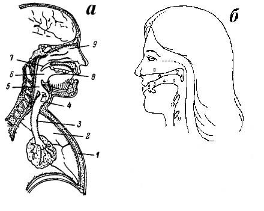

[Предыдущая страница](021.html) | [Следующая страница](023.html)

## 2.2. Принципы артикуляционной деятельности при образовании звуков 
Артикуляционный аппарат, или речевой тракт, человека содержит три основных компонента, 
обеспечивающих образование членораздельной речи: дыхательные органы, 
работа которых во время речепроизводства создает необходимые аэродинамические условия; 
гортань и голосовые связки, поведение которых определяет характер произносимого звука 
(гласный, сонант, звонкий согласный, глухой согласный) и мелодику высказывания в целом; 
надгортанные полости — полость глотки, ртовая полость, полость носа (рис. 2.1). При описании 
артикуляции самое большое внимание обычно уделяют конфигурациям надгортанных полостей —
собственно говоря, именно движения в этой части речевого тракта и называют артикуляторными. 
Относительно дыхательного компонента принимается исходное положение об обязательности выдоха 
при произнесении гласных и согласных; различия между гласными и согласными связаны и с различиями 
в характере речевого выдоха, который может быть более сильным при образовании некоторых согласных 
и совсем слабым при образовании гласных. Речевое дыхание отличается от нормального, физиологического 
дыхания и регулируется такими фонетическими факторами, как темп речи, тип интонационного оформления и др.

||
|Рис. 2.1. Речевой тракт человека.|
|*а* — основные участки речевого тракта: 1 — грудная клетка, 2 — легкие, 3 — трахея, 4 — голосовые связки, 5 — гортань, 6 — полость глотки, 7 — небная занавеска, 8 — полость рта, 9 — полость носа, *б* — активные и пассивные органы, участвующие в образовании звуков: 1 — губы, 2 — зубы, 3 — передняя часть спинки языка, 4 — средняя часть спинки языка, 5 — задняя часть спинки языка, 6 — твердое небо, 7 — мягкое небо, 8 — маленький язычок, 9 — полость носа, 10 — надгортанник, 11 — голосовая щель. |

Поведение голосовых связок при фонетических классификациях также описывается 
очень «лаконично»: отмечается наличие или отсутствие колебательных движений
и в некоторых случаях — их ослабление или усиление. Более детальные характеристики 
голоса необходимы при описании просодических свойств — как известно, мелодика, т. е. 
изменение частоты колебания голосовых связок, играет самую важную роль при интонационном 
оформлении высказывания. 

Произносительные органы делятся на активные и пассивные — на основе их поведения при 
образовании звуков. Активные произносительные органы совершают движения, необходимые 
для образования звука: например, губы смыкаются при образовании смычных губных [p, p’, b, b’, m, m’]; 
язык поднимается вверх и продвигается вперед при образовании гласного [i]. Пассивные органы остаются 
неподвижными при образовании звука, но играют существенную роль в его артикуляции. Например, 
русские согласные [s] и [š] по активному действующему органу оба переднеязычные, но по пассивному 
органу они различаются: при артикуляции [s] передняя часть спинки языка приближается к зубам, 
а при артикуляции [š] — к границе между краем твердого нёба и зубами, поэтому [s] называют зубным,
а [š] — нёбным. Нужно помнить, что эти определения характеризуют согласные не по активным 
артикуляторным характеристикам, а по пассивному органу. 

Артикуляцию каждого звука принято описывать как последовательность трех фаз: экскурсии, т. е. 
перехода произносительных органов из некоторого предшествующего состояния к состоянию, 
необходимому для производства данного звука; выдержки, т. е. сохранения достигнутого
положения на протяжении некоторого времени; рекурсии — перехода к положению покоя или к 
артикуляции следующего звука. Исследования артикуляции в динамике, т. е. при произнесении
связной речи, показали, что каждая из трех фаз может подвергаться различным модификациям. 
Рекурсия может совпасть с экскурсией предшествующего звука, экскурсия — с рекурсией 
следующего, а фаза выдержки часто вообще отсутствует. Вообще представление об отдельном 
звуке как некоторой самостоятельной звуковой единице не вполне соответствует истинному 
положению вещей, поскольку не отдельный звук является минимальной произносительной
единицей (об этом подробнее в разделе, посвященном слогу). 

[Предыдущая страница](021.html) | [Следующая страница](023.html)

