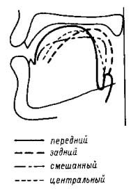
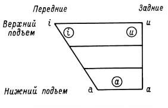
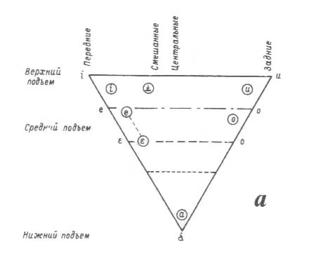
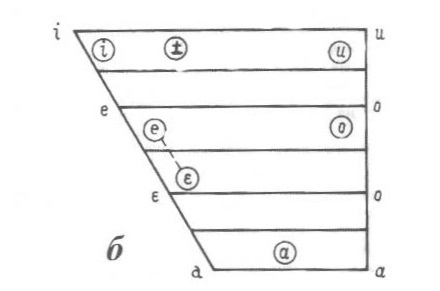
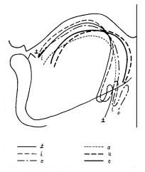

[Предыдущая страница](023.html) | [Следующая страница](025.html)

## 2.4. Артикуляционные характеристики гласных 
Упомянутые в предыдущей главе артикуляционные признаки гласных — ряд, 
подъем и огубленность — с фонетической точки зрения могут интерпретироваться 
по-разному. Рассмотрим на примере русских гласных, какие проблемы собственно 
фонетического характера мы должны решить, создавая артикуляционную классификацию. 

Артикуляционный ряд гласного определяется положением языка по горизонтали: тело
языка сконцентрировано в комок и продвинуто в переднюю или заднюю часть полости рта — 
при такой артикуляции образуются гласные переднего и заднего ряда. Если этот комок находится 
в средней части полости рта, образуются так называемые центральные гласные, а если тело
языка распластано, вытянуто вдоль полости рта, образуются гласные смешанного ряда. 
Такую классификацию гласных по ряду предложил Л. В. Щерба, и она несколько отличается 
от общепринятой классификации, предусматривающей кроме гласных переднего и заднего
ряда наличие только центральных (рис. 2.2). Как мы уже говорили, введение понятия 
среднего ряда при классификации фонологических оппозиций гласных не поддержано 
какими-либо фонетическими реалиями.

||
|Рис. 2.2. Положение языка при артикуляции гласных, различающихся по ряду.|

Фонетический смысл признака подъема гласного связан с определением положения 
языка по вертикали, т. е. с тем, какова степень его подъема по отношению к верхней границе 
полости рта. В соответствии с классификацией Л. В. Щербы возможно различать шесть
степеней подъема, существенных для различения качества гласных. Таким образом, выражение
«гласный среднего подъема», которое мы используем при описании соответствующих русских
гласных, требует существенных уточнений именно с фонетической точки зрения. 

Губные артикуляции сопровождают образование каждого из гласных, однако только для 
определенного класса гласных, характеризующихся округлением и выпячиванием губ,
работа губ считается существенной. Такие гласные называют огубленными в отличие от всех
остальных — неогубленных. 

Удобно строить артикуляционную классификацию гласных по отношению к гласным основного
треугольника. Определим сначала свойства основных аллофонов гласных, находящихся 
в вершинах этого треугольника, — а именно гласных [ɑ], [u], [i]. 

Основной аллофон фонемы /ɑ/ — например, изолированное произношение гласного или его 
произношение в словах типа <i>каждый, бал, шаг</i> и т. д. Это гласный нижнего подъема, заднего 
ряда, неогубленный. По отношению к гласным такого типа в других языках русский гласный
даже в виде своего основного аллофона является несколько продвинутым вперед, однако он 
не совпадает с открытым гласным переднего ряда [a].

Основной аллофон фонемы /u/ — это гласный верхнего подъема, однако не максимальной 
степени закрытости, заднего ряда, огубленный. Основной аллофон фонемы /u/ произносится 
как изолированный гласный или в словах типа <i>бук, купля, шум</i> и т. д. 

Для основного аллофона фонемы /i/ также характерно некоторое «недовыполнение»
артикуляции — этот гласный не является максимально закрытым, однако и не совпадает по 
степени закрытости с гласным [ ┴ ], встречающимся, например, в английском или немецком. 
Основной аллофон этой фонемы произносится в словах типа <i>иглы, сито, вишня</i> и т. д.

Для большей наглядности рассмотрим рис. 2.3, на котором отмечено расположение всех трех гласных на диаграмме в виде трапеции, которая 
образуется путем соединения четырех основных конфигураций языка при произнесении гласных, 
максимально различающихся по ряду и по подъему. Самыми закрытыми, т. е. гласными самого 
верхнего подъема, с общефонетической точки зрения являются гласные [i] и [u], где [u] — 
огубленный гласный заднего ряда, самыми открытыми — гласные [a] и [ɑ], тогда как самыми 
передними являются гласные [i] и [a], а самыми задними — [u] и [ɑ]. При сравнении расположения 
русских гласных на трапеции с расположением основных типов гласных видно, что ни один из 
гласных не совпадает по своим артикуляционным характеристикам с характеристиками гласных, 
находящихся на краях трапеции. Можно объяснить эти особенности артикуляции гласных 
свойствами самой артикуляционной базы русского языка, т. е. теми признаками артикуляции,
которые отличают говорящего по-русски от носителя какого-либо другого языка. По мнению 
многих ученых, для русских характерна вялая артикуляция, слабая напряженность речевого
тракта во время произнесения.

||
|Рис. 2.3. Расположение гласных [ɑ], [u], [i] на схеме артикуляционной трапеции.|
|*Положение русских гласных отмечено знаками в кружочках.*|

Охарактеризовать свойства основных аллофонов гласных среднего подъема довольно трудно 
по двум причинам. Во-первых, неогубленный гласный переднего ряда среднего подъема 
представлен не одним, а двумя аллофонами, которые могут быть названы основными —
правда, на разных основаниях. В словах <i>это, эхо, шест, целый</i> и т. д. мы имеем дело с таким 
основным аллофоном, свойства которого не зависят от фонетического окружения. Это очень 
открытый гласный среднего подъема, в общефонетической классификации такой гласный 
обозначают знаком [ε]. Такой аллофон можно назвать основным строго логически, однако 
для реальной дистрибуции гласного в словах положение в абсолютном начале или после 
твердого согласного — очень редкий случай. Самым распространенным для русского языка 
является сочетание гласного переднего ряда среднего подъема с предшествующим мягким 
согласным: <i>белый, день, темень, на руке</i> и т. д. В этой позиции произносится совсем другой
аллофон — более закрытый и более продвинутый вперед, обозначаемый обычно как [e]. 
Закрытость и продвинутость вперед усиливаются в тех случаях, когда за этим аллофоном следует 
также мягкий согласный. 

Огубленный гласный среднего подъема заднего ряда [o] представлен в фонетически независимых 
позициях, т. е. в абсолютном начале слова и после твердых согласных <i>облако, он, торг, сом</i> и т. д. 
Особенностью русского [o] является его значительная неоднородность — этот гласный начинается 
как [u]-образный звук, а заканчивается как делабиализованный, почти [ɑ]-образный, так что в 
подробной фонетической записи его можно было бы изобразить следующим образом: [uo
ʌ]. 
Более закрытое и более огубленное начало этого гласного — характерная примета русской речи, 
при этом по степени проявления существуют различия между женским и мужским произношением: 
в речи женщин эта неоднородность выражена ярче, чем в речи мужчин. 

Больше всего разнообразных определений артикуляторных характеристик гласного [ɨ]. Самое 
простое решение состоит в том, что этот гласный считают гласным «среднего» ряда — 
как и гласный [ɑ]. Однако фактически гласный [ɨ] не является ни центральным, ни тем 
более смешанным. По степени подъема он принадлежит к гласным самым закрытым, а по 
ряду этот гласный является неоднородным: начинаясь с непередней артикуляции, он 
разворачивается во времени как гласный, произносимый с передне-верхним положением языка,
т. е. как гласный переднего ряда. Дифтонгоидность гласного [ɨ] была замечена еще А. И. Томсоном, 
она, так же как неоднородность гласного [o], является обязательной приметой русской речи, 
а ее отсутствие воспринимается как акцентное произношение. Подтверждение дифтонгоидности [ɨ]
мы найдем в акустических и перцептивных характеристиках этого гласного. 

Рассмотрим положение основных аллофонов всех русских гласных на треугольнике и на 
трапеции гласных (рис. 2.4.).
Видно, что основные аллофоны всех гласных практически не совпадают
ни с одним из теоретически возможных кардинальных гласных. Оценивая в целом 
артикуляторные свойства основных аллофонов русских гласных, можно объяснить их
специфические особенности двумя факторами. Первый из них — фонологический: поскольку 
число гласных фонем в системе невелико, вариативность артикуляторных характеристик даже
основных аллофонов может быть довольно большой — это видно на примере аллофонов
фонемы /е/, основные аллофоны которой фонетически различаются не меньше, чем разные
фонемы, например, во французском. Второй фактор, определяющий значительную вариативность
гласных, — это ненапряженность, вялость артикуляции, приводящая к значительной 
неоднородности гласного даже в фонетически сильной позиции. Яркий пример —
неоднородность артикуляции аллофонов фонем /о/ и /ɨ/.

||
||
|Рис. 2.4. Расположение основных аллофонов русских гласных: *а* — на схеме артикуляционного треугольника; *б* — на схеме трапеции.|
|*Дифтонгоидность [ɨ] и [o] на этих схемах не отражена; для /e/ указаны два основных аллофона.*|

На примере артикуляторной классификации русских гласных мы видим, как трудно найти 
однозначное соответствие между собственно фонетическими свойствами и теми признаками, 
которые являются фонологически релевантными. С фонологической точки зрения 
дифтонгоидность [ɨ] и [o] не имеет никакого значения, как и продвинутость вперед заднерядного
[ɑ]. Именно поэтому можно построить классификацию, использующую артикуляторную 
терминологию, но не отражающую собственно артикуляторных особенностей гласных. 
Однако попытка синтезировать какое-нибудь слово на основе такой фонологической классификации 
потерпела бы полную неудачу, потому что проартикулировать любой гласный без привлечения 
дополнительных фонетических сведений, упомянутых выше, невозможно. Фонетическая
классификация включает в себя не только те свойства, которые отличают гласные друг от друга, 
но и те, которые присущи гласным именно данного языка.

Для более полного представления о том, как именно артикулируется тот или иной гласный, 
необходимо получить сведения о положении языка, губ, мягкого неба, нижней челюсти во 
время артикуляции. На рис. 2.1 мы увидели как бы разрез головы очень симпатичной девушки 
с указанием различных участков речевого аппарата, а на рис. 2.2 — схематическое изображение 
артикуляций разных гласных. Эти рисунки строятся на основе рентгенографичесих съемок 
произносительных органов; в учебной и научной литературе используют также 
схематизированные изображения — «профили артикуляций», и для наглядности приведем здесь 
профили артикуляций основных аллофонов русских гласных (рис. 2.5).

||
|Рис. 2.5. Профили артикуляций основных аллофонов русских гласных.|
|*Обратите внимание на связь между положением передней части спинки языка и положением корня языка.*|

Нужно иметь в виду, что между разными людьми, говорящими по-русски, могут наблюдаться 
некоторые расхождения в артикуляциях. Это объясняется, в первую очередь, тем, что 
конфигурация речевого аппарата может быть различной — например, существуют сильные 
различия по высоте свода твердого неба — и для достижения необходимого акустического
эффекта возникает так называемая компенсаторная артикуляция, т. е. язык может подниматься 
чуть больше или чуть меньше, продвигаться вперед или назад также с некоторыми отклонениями 
от приводимых схем. Важно, что различия между артикуляциями разных гласных обеспечивают 
нормальное их звучание независимо от особенностей анатомического строения произносительного
аппарата. 

[Предыдущая страница](023.html) | [Следующая страница](025.html)

