[Предыдущая страница](024.html) | [Следующая страница](031.html)

## 2.5. Артикуляционные характеристики согласных 
При знакомстве с системой согласных фонем мы уже охарактеризовали основные артикуляционные 
признаки, по которым можно классифицировать согласные фонемы русского языка. Остановимся 
подробнее на каждом из этих признаков и охарактеризуем, как и в случае с гласными, основные 
аллофоны согласных фонем. Позицией, в которой реализуется основной аллофон согласной фонемы, 
можно было бы считать такую фонетическую позицию, которая обеспечивает максимальную 
независимость артикуляции согласного от окружающих его звуков; в этом отношении положение 
в сочетании типа «гласный + согласный», например <i>от, ус, ил</i> и т.д., кажется очень подходящим. 
Однако на самом деле это не так — во-первых, далеко не все согласные в русском языке возможны 
в абсолютном конце слова (эта позиция исключена для звонких шумных согласных и для заднеязычного 
щелевого мягкого [х’]), а во-вторых, как показывают наблюдения над артикуляцией, наиболее удобной
для согласного является позиция перед гласным. Поэтому будем считать, что основной аллофон
каждой согласной фонемы произносится в соседстве с таким гласным, артикуляция которого 
меньше всего влияет на артикуляцию этого согласного. Например, для переднеязычных твердых 
согласных позицией фонетической независимости может быть позиция перед гласным переднего 
ряда: [tε, dε, sε, zε, cε и т.д.], для заднеязычных — соседство с гласным [ɑ]: [kɑ, gɑ, xɑ], для всех
мягких согласных — положение перед [i]: [p’i, b’i, l’i, x’i и т.д.]. Заметим, что фонетически удобная 
для реализации основного аллофона позиция не совпадает с фонологической позицией, подтверждающей 
самостоятельность признака. Это хорошо видно на последнем примере: основанием для признания 
мягких согласных как самостоятельных фонем является то, что они употребляются перед непередними
гласными, а для выявления их основных аллофонов нужно рассматривать их реализации именно 
перед передними гласными. 

Рассмотрим артикуляции основных аллофонов согласных, различающихся по активному действующему органу. 
**Губные** образуются при активном участии губ. Губные /p, p’, b, b’, m, m’/ образуются при полном 
смыкании обеих губ, поэтому они называются смычными. Время выдержки смычки определяется,
как мы уже говорили при первом знакомстве с артикуляторным аспектом, специальной управляющей
командой из речевых центров коры головного мозга. Обычно длительность смычки глухих согласных 
больше, чем длительность смычки звонких, а длительность сонантов меньше, чем длительность звонких 
шумных. Так что расположение губных согласных в принятом нами порядке как бы соответствует их 
собственной длительности — от самой большой для глухих до самой маленькой для сонантов. Правда,
нужно заметить, что мягкие согласные, как правило, имеют большую длительность, чем соответствующие твердые. 

Здесь мы говорим только об их относительной длительности, так как абсолютная зависит от темпа речи, 
от индивидуальных особенностей говорящего, от типа произнесения и т.д. 

|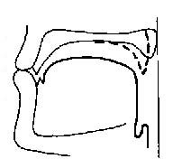|
|Рис. 2.6. Профили артикуляций губных смычных - ртового [b] и носового [m].|
|*Пунктиром показано положение мягкого неба при артикуляции носового.*|

Размыкание смычки происходит также в соответствии с артикуляторной командой «сверху» — 
не верьте тем авторам, которые пишут, что смычка раскрывается под напором воздуха, выходящего 
из легких! Раскрытие смычки — такой же активный процесс, как ее образование. При этом
выходящий поток воздуха характеризуется большей силой при артикуляции глухих /p, p’/, раскрытие 
звонкой смычки согласных /b, b’/ сопровождается более слабым воздушным потоком, а при раскрытии 
смычки носовых /m, m’/ этот поток совсем слабый, поскольку еще во время смычки воздух выходит 
через полость носа благодаря тому, что небная занавеска опущена (рис. 2.6). Голосовые связки 
не работают во время артикуляции глухих согласных и работают при образовании звонких и сонантов. 
О различии в артикуляции твердых и мягких согласных мы будем говорить применительно 
ко всем согласным — в специальном разделе этой главы. 

Губные щелевые согласные /f, f’, v, v’/ образуются в результате сближения нижней губы с краем верхних 
зубов и поэтому являются губно-зубными (рис. 2.7). 
По длительности отношения внутри этой группы подчиняются уже отмеченной закономерности: 
глухие длительнее звонких, а мягкие длительнее твердых. Воздушная струя выходит с большей 
силой при артикуляции глухих, чем при артикуляции звонких, а различия между глухими и 
звонкими по работе голосовых связок такие же, как для смычных согласных. 

|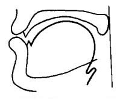|
|Рис. 2.7. Профили артикуляций губных щелевых.|

**Переднеязычные** образуются при активном участии передней части спинки языка. Большинство 
русских переднеязычных согласных является дорсальными, т. е. при их артикуляции самый кончик 
языка опущен вниз. Группа смычных согласных включает в себя взрывные /t, t’, d, d’, n, n’/ и 
аффрикаты /c, č/; смычка образуется между передней частью спинки языка и верхними зубами и 
твердым небом (рис. 2.8). Если не касаться особенностей артикуляции твердых и мягких согласных,
то различия между глухими, звонкими и сонантами в этой группе такие же, как и в группе губных смычных. 

|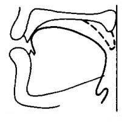|
|Рис. 2.8. Профили артикуляции переднеязычных смычных - ртового [d] и носового [n] - фаза смычки.|
|*Пунктиром показано положение мягкого неба при артикуляции носового.*|

Аффрикаты, в отличие от взрывных, после раскрытия смычки завершаются щелевой фазой. Длительность
смычки у аффрикат гораздо меньше, чем у взрывных согласных, а артикуляция смычки совпадает с артикуляцией 
взрывного твердого /t/ для /c/ и с артикуляцией /t’/ для /č/. Характер щели у /с/ такой же, как и при
образовании щелевого /s/, а при артикуляции /č/ щелевая фаза такая же, как при артикуляции [š’] 
(рис. 2.9). 

|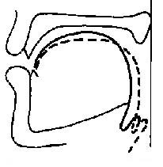|
|Рис. 2.9. Профили артикуляции щелевой фазы аффрикат [č] (сплошная линия) и [c] (прерывистая линия). |

Щелевые согласные /s, s’, z, z’/ образуются в результате сближения передней части спинки языка с 
верхними зубами и твердым небом (рис. 2.10). Они являются круглощелевыми, поскольку при их произнесении края языка приподняты и воздушная струя проходит по образовавшейся в средней части языка круглой щели. Отношения по длительности в этой группе также подчиняются общему правилу — глухие 
длительнее звонких, а мягкие длительнее твердых.

|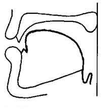|
|Рис. 2.10. Профили артикуляции однофокусных щелевых твердых [s] и [z].|

Согласные /š/ и /ž/ образуют специфическую группу: традиционно их описывают как переднеязычные 
двухфокусные щелевые со вторым задним фокусом; при этом подразумевается, что второе сужение 
образуется благодаря подъему задней части спинки языка, однако последние наблюдения над артикуляцией
таких согласных показывают, что было бы правильнее называть их длиннощелевыми, поскольку 
при их произнесении образуется довольно длинная и плоская щель. Заметим, что в отличие от уже 
упомянутых переднеязычных согласных /š/ и /ž/ являются не дорсальными, а какуминальными, 
т. е. при их образовании кончик языка поднят вверх (рис. 2.11). Отметим также, что эти согласные не имеют соответствующих мягких, а /š:/ 
отличается от /š/ не только мягкостью, но и долготой. Таким образом, по относительной
длительности эти согласные выстраиваются в цепочку /ž, š, š:/.

|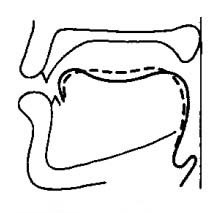|
| Рис. 2.11. Профили артикуляции двухфокусных щелевых [š] и [ž].|
|*Сплошная линия - ярко выраженный двухфокусный, прерывистая линия - длиннощелевой.*|

Переднеязычные щелевые сонанты /l/ и /l’/ образуются при поднятой вверх передней части спинки языка,
которая смыкается с верхними зубами, при этом края языка опущены и образуют довольно широкий 
проход для воздушной струи. Твердый /l/ является веляризованным, т. е. образуется при поднятом к
мягкому небу корне языка, при этом многие отмечают, что он и апикальный — при его артикуляции 
кончик языка поднят и смыкается с верхними зубами (рис. 2.12). Мягкий /l’/ — дорсальный.

|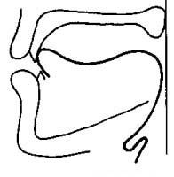|
|Рис. 2.12. Профиль артикуляции бокового сонанта [l].|

Особую группу переднеязычных составляют дрожащие /r, r’/, которые образуются благодаря вибрациям 
поднятого кончика языка. Твердый дрожащий является какуминальным, а мягкий — дорсальным. 
Количество вибраций — или ударов — может быть различным и зависит от многих факторов. 
Чаще всего в сочетании типа CV твердый дрожащий бывает двухударным, тогда как мягкий — 
одноударным. Об особенностях мягкого дрожащего, как и обо всех остальных мягких, см. в специальном разделе. 

**Заднеязычные** — самая малочисленная группа, поскольку состоит только из четырех смычных взрывных 
— /k, k’, g, g’/ — и двух щелевых — /x, x’/. Длительность этих согласных подчинена уже известной 
нам закономерности, но нужно специально отметить, что длительность фазы взрыва у заднеязычных 
максимальная по сравнению с губными (у которых она минимальная) и переднеязычными. Это можно
объяснить довольно большой площадью касания языка с небом, так что при размыкании смычки 
воздушная струя проходит как бы через небольшую щель (рис. 2.13). 

|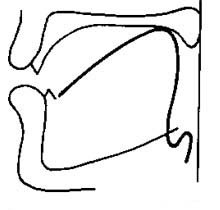|
| Рис. 2.13. Профили артикуляции заднеязычных смычных [k] и [g].|

Артикуляция **мягких согласных** часто описывается как результат наложения на основную 
артикуляцию согласного дополнительной артикуляции палатализации, т. е. подъема средней части 
спинки языка к твердому небу. Такую артикуляцию называют часто i-образной, что справедливо, 
поскольку при произнесении [i] средняя часть спинки языка действительно поднята к твердому небу.
Исторически мягкие согласные в русском языке возникли там, где твердые согласные оказывались 
перед гласными переднего ряда или перед /j/. Однако трактовать мягкость русских согласных как 
результат наложения дополнительной артикуляции на основную нельзя, это неверное описание 
признака. Рассматривать основную и дополнительную артикуляции как независимые друг от друга
можно с некоторой натяжкой только для губных согласных (рис. 2.14), поскольку можно предположить, что при образовании
губной смычки или щели язык «ведет себя» независимо и его положение определяет твердую 
или мягкую артикуляцию. Однако и при этом мы не учитываем обязательных различий в самой 
губной артикуляции твердых и мягких: как показывают многие специальные исследования, губная 
смычка мягких согласных осуществляется большей частью поверхности губ и при их большей 
напряженности, чем смычка твердых. 

|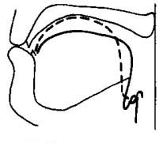|
|Рис. 2.14. Артикуляция твердого (сплошная линия) и мягкого (прерывистая линия) губного смычного согласного.|

Сопоставление артикуляций твердых и мягких язычных согласных показывает, что мы имеем дело
с полной перестройкой уклада произносительных органов, а не с простым сложением основной и
дополнительной артикуляций. Так, при произнесении переднеязычных мягких активно участвует 
не только передняя часть спинки языка, но обширная площадь, включая и среднюю часть спинки, 
так что в результате получатся в принципе различные звуки: если переднеязычные твердые /t, d/ 
являются взрывными не только фонематически, но и фонетически, то соответствующие мягкие /t’, d’/
фонетически являются сильно аффрицированными звуками, т. е. вместо быстрого размыкания смычки
для них характерно появление щелевой фазы, что сближает их с аффрикатами (рис. 2.15).

|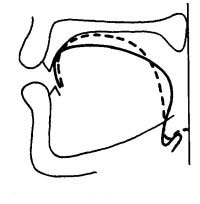|
|Рис. 2.15. Артикуляция твердого (сплошная линия) и мягкого (прерывистая линия) переднеязычного согласного.|

Переднеязычные дрожащие /r, r’/ также сильно различаются по своим артикуляторным характеристикам: 
если при произнесении твердого кончик языка слегка поднят вверх и оттянут назад, то при активности 
средней части спинки языка, необходимой для образования мягкого, такое положение кончика языка 
становится уже невозможным — и в результате мягкий «дрожащий» уже не является в полном смысле 
слова дрожащим (попробуйте произнести слово риск с таким же раскатистым первым согласным,
как в рама!). 

Различия между твердыми и мягкими заднеязычными еще более значительны, поскольку активная 
деятельность средней части спинки языка сильно продвигает вперед зону заднеязычной артикуляции,
так что заднеязычные мягкие уже трудно считать собственно заднеязычными по их фонетическим 
свойствам (рис. 2.16).

|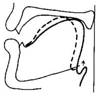|
|Рис. 2.16. Артикуляция твердого (сплошная линия) и мягкого (прерывистая линия) заднеязычного согласного.|

К рассмотрению этого признака мы еще вернемся при анализе акустических характеристик согласных,
а также и при характеристике перцептивной системы носителей русского языка, однако уже сейчас
мы можем сделать вывод о том, что простые и регулярные фонологические отношения между твердыми 
и мягкими фонемами не обеспечивают таких же простых отношений между фонетическими свойствами 
соответствующих согласных. 

## Литература
<ol>
<li>Богородицкий В.А. Фонетика русского языка в свете экспериментальных данных. Казань, 1930. </li>
<li>Матусевич М.А., Любимова Н.А. Альбом артикуляций звуков русского языка. М., 1963. </li>
<li>Скалозуб Л.Г. Динамика звукообразования (по данным кинорентгенографирования). Киев, 1979. </li>
<li>Скалозуб Л.Г. Палатограммы и рентгенограммы согласных фонем русского литературного языка. Киев, 1963. </li>
<li>Сорокин В. Н. Теория речеобразования. М., 1985. </li>
<li>Томсон А. И. Фонетические этюды I-III. Варшава, 1905. С. 1-46.</li>
<li>Чистович Л.А., Кожевников В.А. и др. Речь: Артикуляция и восприятие. М.; Л., 1965. </li>
</ol>

[Предыдущая страница](024.html) | [Следующая страница](031.html)

